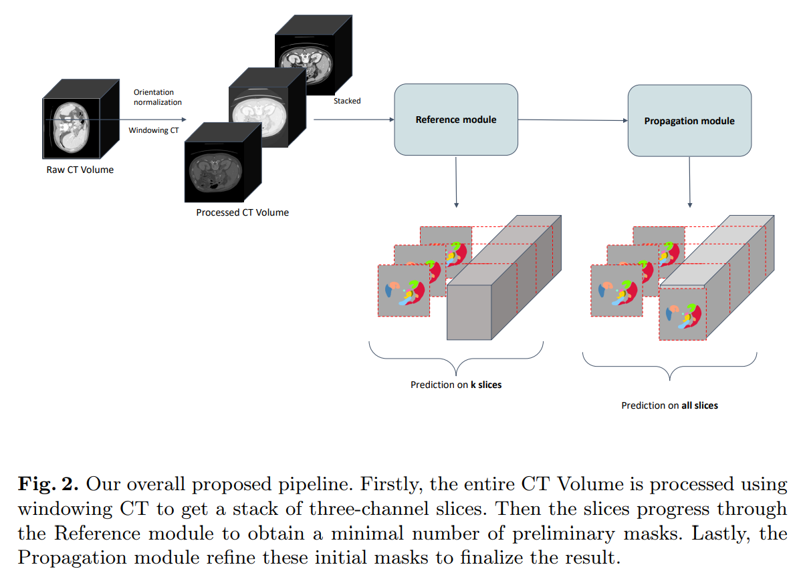
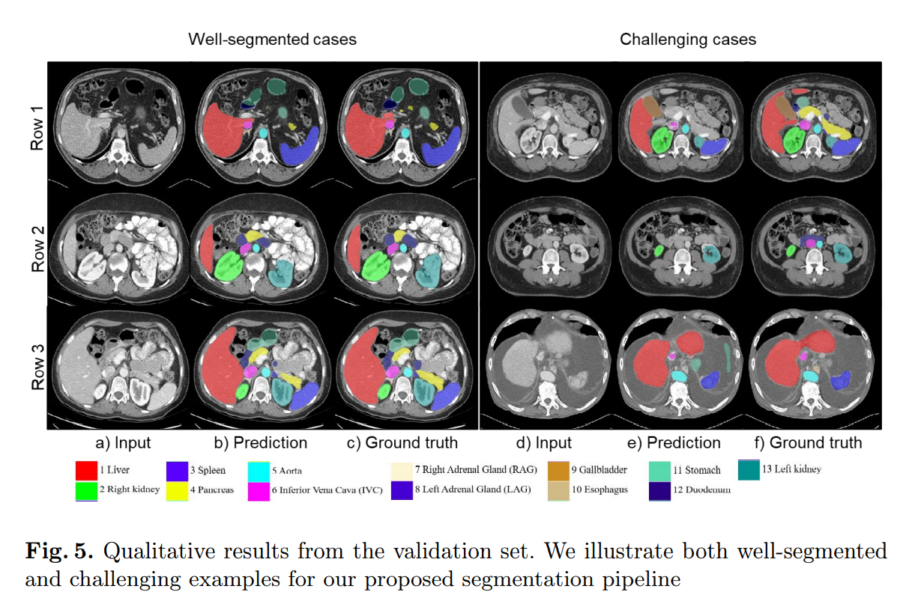

# <p align="center"> Semi-supervised organ segmentation with Mask Propagation Refinement and Uncertainty Estimation for Data Generation </p>

We present a novel two-staged method that employs various 2D-based techniques to deal with the 3D segmentation task. In most of
the previous challenges, it is unlikely for 2D CNNs to be comparable with other 3D CNNs since 2D models can hardly capture temporal information. In light of that, we propose using the recent state-of-the-art technique in video object segmentation, combining it with other semi-supervised training techniques to leverage the extensive unlabeled data. Moreover, we introduce a way to generate pseudo-labeled data that is both plausible and consistent for further retraining by using uncertainty estimation. 

We also deploy an annotation tool with user-friendly GUI that is based on this proposed algorithm [here](https://github.com/nhtlongcs/ivos-gui) 


<p align="center">


</p>

## **Environment and Requirements**

Windows/Ubuntu version | Ubuntu 18.04.5 LTS
--- | --- 
CPU | Intel(R) Xeon(R) Silver 4210R CPU @ 2.40GHz
RAM | 1×32GB;
GPU (number and type) | One Quadro RTX 5000 16G
CUDA version | 11.6
Programming language | Python 3.10
Deep learning framework | Pytorch (Torch 1.11.0, torchvision 0.12.0)


- To install requirements, go to root folder, run `pip install -r requirements.txt`

## **Reproducibility**
- To reproduce the results that were reported in FLARE22 Challenge, please see [Docker](Docker.md)

## **Data Preparation**

- We reuploaded the original data from [FLARE22 Challenge](ivos/FLARE22.md) onto Drive, use below scripts to download and preprocess the data before training.

```
sh tools/scripts/download_data.sh
sh tools/scripts/preprocess_data.sh
```

- After processing, the data structure should be as followed:
```
this repo
│   
└───data
|   └───flare22
|       └───raw
|       └───slices    # For training
|       └───npy       # For inference/evaluation
```
- In each of these folder should be subfolders for training/val/validation images and masks. 

## **Training**

### Reference module

- We use Cross Pseudo Supervision (CPS) for the Reference module. Basically, CPS can be trained from scratch but we recommend training each model individually first.

- To train individual model, customize `configs/flare22v2/normal/pipeline.yaml` then run
```
sh tools/scripts/train_normal.sh <run_name> <save_dir>
```

- To train cps model, customize `configs/flare22v2/cps/pipeline.yaml` then run
```
sh tools/scripts/train_cps.sh <run_name> <save_dir>
```

### Propagation module

- We adapt [STCN](https://github.com/hkchengrex/STCN) as the core algorithm to our problem with adjustments.

- To train stcn model, customize `configs/flare22v2/stcn/pipeline.yaml` then run
```
sh tools/scripts/train_cps.sh <run_name> <save_dir>
```

## **Inference**

- You can download the checkpoints from wandb by using
```
sh tools/scripts/download_weights.sh
```
which saves the trained weights to `weights` folder. These can be used to reproduce the results that we reported in the paper

- To perform 2-stage inference, please modify `configs/flare22v2/stcn/test.yaml`, then run
```
sh tools/scripts/infer_stcn.sh 
```
which will then save the results inside `runs/<model_name>/`. Submission file along with visualization will be saved here.

- For other inference settings, some scripts are also provided.

## **Pseudo-labeling with Active Learning**

- We use Uncertainty Estimation based on mutual agreement to generate pseudo-labels for retraining. Put all results that are infered using provided inference scripts into the same <prediction_dir> folder. Then run

```
sh tools/scripts/pseudo_label.sh <prediction_dir> <save_dir>
```

## **Evaluation**
- Standalone evaluation scripts officially provided by the organizers 
```
python tools/evaluation/DSC_NSD_eval.py \
  -g <ground truth mask> \
  -p <prediction mask>
```

## Results
- The results are officially reported by the organizers of FLARE22 Challenge

Classes/Metrics | DSC | NSD
--- | --- | ---
Liver | 0.974 ± 0.036 | 0.963 ± 0.063
Right Kidney (RK) | 0.883 ± 0.233 | 0.868 ± 0.241
Spleen | 0.9494 ± 0.115 | 0.935 ± 0.134
Pancreas | 0.772 ± 0.147 | 0.877 ± 0.145
Aorta | 0.96 ± 0.045 | 0.976 ± 0.06
Inferior Vena Cava (IVC) | 0.86 ± 0.123 | 0.86 ± 0.143
Right Adrenal Gland (RAG) | 0.735 ± 0.138 | 0.855 ± 0.144
Left Adrenal Gland (LAG) | 0.69 ± 0.171 | 0.816 ± 0.2
Gallbladder | 0.75 ± 0.313 | 0.733 ± 0.328
Esophagus | 0.783 ± 0.147 | 0.88 ± 0.143
Stomach | 0.86 ± 0.113 | 0.84 ± 0.142
Duodenum | 0.6 ± 0.2 | 0.79 ± 0.215
Left Kidney (LK) | 0.877 ± 0.22 | 0.863 ± 0.23
Mean | 0.8233 | 0.8668

## **References**

- https://github.com/kaylode/theseus
- https://github.com/hkchengrex/STCN
- https://github.com/hkchengrex/MiVOS
- https://github.com/hkchengrex/XMem

```
@inproceedings{cheng2021stcn,
  title={Rethinking Space-Time Networks with Improved Memory Coverage for Efficient Video Object Segmentation},
  author={Cheng, Ho Kei and Tai, Yu-Wing and Tang, Chi-Keung},
  booktitle={NeurIPS},
  year={2021}
}

@inproceedings{cheng2021mivos,
  title={Modular Interactive Video Object Segmentation: Interaction-to-Mask, Propagation and Difference-Aware Fusion},
  author={Cheng, Ho Kei and Tai, Yu-Wing and Tang, Chi-Keung},
  booktitle={CVPR},
  year={2021}
}

@inproceedings{cheng2022xmem,
  title={{XMem}: Long-Term Video Object Segmentation with an Atkinson-Shiffrin Memory Model},
  author={Cheng, Ho Kei and Alexander G. Schwing},
  booktitle={ECCV},
  year={2022}
}
```
